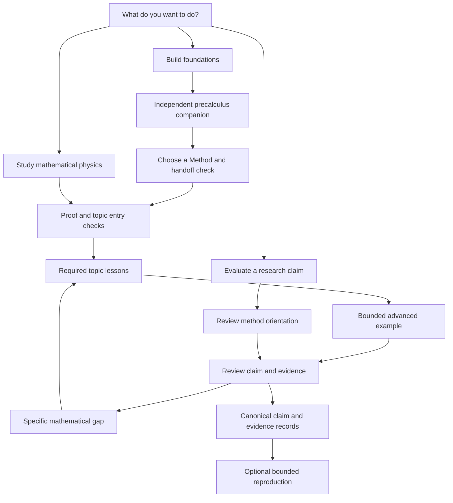

# What should I learn next, and why?

Content inventory and reader-journey map, inspected 2026-09-05.

This document retains the starting inventory and proposed design. The
[implementation and verification record](INFORMATION_ARCHITECTURE.md) owns the
resulting curriculum, navigation, and disposition of the open items.

The learning album should continue from **Precalculus Through Problems of the
Past**, an independent companion, through selected mathematical tools into
questions about mathematical physics and research evidence. The companion owns
its text and its teaching style. MathScienceCompendium owns the continuation.
Readers should move between separately usable books through explicit handoffs.

This document records the first design deliverable. Inventory statements describe
inspected sources; journey tables and acceptance criteria propose subsequent
work. The current combined-PDF assembler remains an implementation to replace
within a later navigation change. Lesson manuscripts and the external checkout
remain outside the edits for this deliverable.

## Inspection boundary and source identity

- MathScienceCompendium HEAD: `2a48521f99e948361407d7b576ce3623054c26dc`.
- Companion checkout: `~/Github/precalc_paper`; HEAD:
  `1438539ab556c8343e281b690c314f6a1fd4b184`.
- The companion has tracked modifications and untracked active lesson sources.
  The inspected curriculum is its working edition, rather than the HEAD tree.
- `pdfinfo` reports 34 pages in the companion's existing `build/main.pdf`.
  The companion describes a 20–35-page standard edition. Page count alone
  establishes neither source/PDF parity nor visual quality.
- The album [manifest](library.json) pins companion commit
  `7b4c9af67bd13b1c93f7443ff84022c64e894275` and the older title
  *A Precalculus Compendium*. That pin does not identify the working edition.
- Inspection read sources, guides, metadata, and existing audit records. The
  companion build was outside the execution scope: `make album` invokes a build
  inside the external checkout. Fresh rendered-page inspection remains a
  prototype gate.

The main source entry points determine active content. A directory listing alone
would mix retained older chapters with the modern curriculum. The companion's
`main.tex`, `README.md`, `docs/narrative_style_guide.md`, and
`docs/lesson_information_design.md` establish the reference edition and its
teaching components. These files are local reference sources; a later publication
must identify a stable companion edition before publishing precise destinations.

## Content inventory

### Books and supporting surfaces

| Surface | Reader job and content role | Entry and granularity | Present navigation or gap |
|---|---|---|---|
| Independent precalculus companion | Build foundations; teaching, worked practice, solutions, quick reference, historical evidence | External `main.tex`: orientation, nine instructional lessons, transfer practice, source finder, bibliography, index | Question-based method finder and Methods/History/Index navigation; album metadata describes an older edition |
| Bridge book | Learn selected undergraduate tools; teaching and solved exercises | [Main source](../../papers/learning/main.tex): ten chapters, with three independently routed sections in the last chapter | Opening cards and four generated routes; prerequisites sometimes assume material absent from the compact companion |
| Critical review | Evaluate mathematical, computational, and physical claims; research interpretation and reference | [Main source](../../papers/main.tex): eight chapters and reproducibility appendix | Contents and evidence-status blocks; four learning nodes expose only selected review destinations |
| Executable framework | Inspect or reproduce a specified computation; code and research evidence | [Architecture](../ARCHITECTURE.md), `src/mathphysics/`, `experiments/`, `tests/` | Root README offers setup commands; lesson-to-operation links need a bounded task and expected result |
| Scientific registries | Find authoritative claim disposition, hypotheses, contracts, and reproduction evidence | [Authority surfaces](../framework/AUTHORITY_SURFACES.md) | Canonical records distinguish consistency from scientific admission; readers need nearby claim-level links |
| Learning registry and verifiers | Maintain reading dependencies and bounded mathematical examples | [Library](library.json), [audit](AUDIT.md), `scripts/validate_learning_library.py`, `scripts/verify_learning_examples.py` | 3 books, 17 nodes, 4 routes; assessment text usually says to attempt three exercises |
| Repository landing and route guide | Choose purpose, reading route, or computation | [README](../../README.md), [learning guide](README.md) | Topic routes appear before an explicit starting-knowledge decision |
| Retained manuscripts and reports | Historical research inputs | `papers/sections/vol*_*.tex`, `docs/reports/` | Separate from active review; route discovery must preserve archival labeling |

The executable framework is a supporting workbench. Installing Python dependencies
should become necessary when a reader chooses a reproducibility task, rather than
an entry requirement for reading a lesson.

### Companion curriculum and handoff

The source names below are relative to `~/Github/precalc_paper/sections/`.
They identify active content without copying the companion manuscript.

| Source | Current role and transferable operation | Useful continuation |
|---|---|---|
| `lesson_begin.tex` | Orientation: observe, calculate, check, find a method | Album purpose chooser after completing or testing foundations |
| `lesson_ledger.tex` | Quantities, shares, signed arithmetic | Probability's finite counts and fractions |
| `lesson_measurement.tex` | Length, area, expansion, square roots | Proof through identities; later geometric interpretation |
| `lesson_balance.tex` | Equations, reversible operations, elimination | Coordinate vectors and matrix maps, with new notation taught here |
| `lesson_square.tex` | Completing squares, roots, introduction to complex numbers | Proof and later complex arithmetic preparation |
| `lesson_coordinates.tex` | Functions, graphs, interpreting inputs and outputs | Calculus or linear maps |
| `lesson_quotient.tex` | Quotients and domain restrictions | Proof assumptions and limits |
| `lesson_circle.tex` | Angles, ratios, motion | Calculus trigonometric examples |
| `lesson_growth.tex` | Powers, logarithms, multiplicative growth | Calculus and exponential dynamics |
| `lesson_sequence.tex` | Terms, finite totals, geometric limiting total and error | Proof induction and controlled limits |
| `lesson_practice.tex` | Transfer: choose method, units, domain, and answer check | Explicit handoff into this repository |
| `A5_chronology_guide.tex`, bibliography, index | Historical source and reference lookup | Return for evidence or method lookup as needed |

The handoff should begin with the skills exercised in **Choose a Method**.
Completing that section establishes a useful starting conversation, rather than
mastery of all the assumptions in the bridge book. The existing bridge opening
asks for matrix multiplication and directs readers to precalculus matrices.
The active compact companion introduces elimination but lacks an instructional
matrix/vector sequence. Teach coordinate vectors, dot products, and matrix
multiplication in this repository before the current linear-algebra entry.
Likewise, teach complex conjugation, modulus, and multiplication before quantum
states and complex analysis; a quadratic with complex roots supplies only part
of that preparation. Keep formal limits in the calculus continuation and connect
them to the companion's geometric-tail bound.

### Bridge lesson inventory and proposed readiness contracts

The `requires` column transcribes direct dependencies in `library.json`.
Outcomes, checks, helpful background, and next choices below are editorial
proposals grounded in the chapter topics. They require explicit solution and
remediation links during implementation. Successful checks indicate readiness
for the named next task, rather than course completion.

| Node / source in `papers/learning/chapters/` | Current required nodes | Proposed observable outcome and exit check | Helpful background / next useful lesson and reason |
|---|---|---|---|
| `proof` / `proof.tex` | precalc | State a domain and prove the sum of two odd integers is even; identify the two integer witnesses | Historical proof examples / linear algebra for maps, calculus for limits, probability for uncertainty |
| `linear_algebra` / `linear_algebra.tex` | proof | Compute a matrix action and verify an eigenpair by multiplication; first add the coordinate-operations entry unit | Geometry aids intuition; calculus supports the spectral-proof discussion / algebra for symmetry or multivariable for local maps |
| `calculus` / `calculus.tex` | proof | Derive the derivative of a quadratic from a difference quotient and justify a remainder bound | Physical motion / multivariable to vary several inputs |
| `multivariable` / `multivariable.tex` | linear_algebra, calculus | Compute a gradient and a Jacobian area factor with its domain | Physical fields / dynamics to express conservation through time |
| `dynamics` / `dynamics.tex` | multivariable | Solve exponential decay with initial data and identify stable Euler step sizes | Heat transport / numerical reasoning to distinguish discretization from model behavior |
| `probability` / `probability.tex` | proof | Reconstruct the diagnostic posterior from joint counts; identify the assumptions behind an interval | Calculus for later continuous distributions / evidence method directly, or quantum after linear algebra |
| `numerical` / `numerical.tex` | dynamics | Separate truncation, roundoff, and conditioning; explain a refinement comparison against an oracle | Probability helps interpret ensembles / fluid moments for a conservation example |
| `algebra` / `algebra.tex` | linear_algebra | Compute a commutator and check a stated root-system property | Classification history / hypercomplex operations or geometry's modular transformations |
| `geometry` / `geometry.tex` | multivariable, algebra | Explain Cantor scaling and test complex differentiability with stated assumptions; add complex arithmetic preparation | Topological examples / modular forms and fractal dimensions in the review |
| `hypercomplex` / `advanced.tex` | algebra | Reproduce a quaternion product and explain what a zero-divisor witness rules out | Complex arithmetic / review mathematical baseline for the claim boundary |
| `quantum` / `advanced.tex` | linear_algebra, probability | Normalize a complex state, compute Born probabilities, and check a unitary action; add complex preparation | Physics motivation / evidence method to distinguish a postulate from a calculation |
| `fluids` / `advanced.tex` | numerical | Check zeroth and first D2Q9 moments and explain the separate convergence obligation | Continuum fluid mechanics / computational portfolio, adding probability for its comparisons |

Ten chapter files supply twelve bridge route nodes because `advanced.tex` owns
three destinations. Each chapter has three solved exercises; the advanced
sections share that chapter-level exercise set. Preserve section-level
assessment destinations when splitting navigation. The manifest has one
`requires` list and an assessment string per node; explicit outcomes, helpful
background, readiness/remediation links, and next-step reasons need a designed
schema extension. Avoid silently turning every recommended reading order into
a required prerequisite.

### Review inventory and evidence destinations

All sources below live in `papers/sections/` and are included by `papers/main.tex`.

| Source | Reader task | Learning-route coverage |
|---|---|---|
| `review_scope_method.tex` | Distinguish evidence types and follow claim-to-evidence protocol | `review_evidence`, requires probability |
| `review_critique_reassessment.tex` | Examine the reassessment of criticisms | Contents only |
| `review_mathematical_baseline.tex` | Locate established algebra, modular forms, and fractal facts | `review_algebra` requires hypercomplex; `review_geometry` requires geometry |
| `review_physical_claims.tex` | Test proposed physical inference and admission boundaries | Contents only |
| `review_computational_evidence.tex` | Inspect bounded computations, defects, and controlled comparisons | `review_computation`, requires fluids and probability |
| `review_framework_reconciliation.tex` | Understand reconciled authority and evidence layers | Contents only |
| `review_hypothesis_registry.tex` | Find hypothesis status and promotion requirements | Contents only |
| `review_conclusions.tex` | Read dispositions and their limits | Contents only |
| `review_reproducibility.tex` | Locate build instructions and evidence-bearing artifacts | Appendix, contents only |

The four registered review destinations use the same assessment: identify an
established result, a computational check, and the extra evidence needed for a
physical claim. A claim reader also needs a direct route to physical claims,
hypothesis records, and conclusions. Give each destination a specific exit task:
state the claim, classify support, locate its record, and explain the bounded
disposition. Keep reading an overview distinct from reproducing its mathematics.

## Reader-journey map

Separate the reader's **purpose** from their **topic**. All three purposes can
use reference lookup; only a chosen computational task needs an execution path.

| Reader and starting knowledge | First destination | Journey and reason | Readiness decision and recovery | Useful stopping point |
|---|---|---|---|---|
| Build foundations; arithmetic or algebra is uncertain | Companion method finder, then the needed lesson | Work through the compact companion to Choose a Method; enter proof to explain why operations generalize | Explain units, domains, and an equation solution; return to the named companion method when reasoning breaks | Solve a transfer problem and explain the method choice |
| Study mathematical physics; comfortable with companion transfer problems | This repository's entry check and topic chooser | Proof, then the topic sequence below; fill vector/matrix or complex-operation gaps at their point of use | Attempt the next lesson's entry task; follow a repair link for the failed operation | Work one advanced example and state its assumptions |
| Evaluate research claims; wants to assess support before studying every derivation | Review Scope, Questions, and Review Method as orientation | Claim statement -> disposition -> supporting evidence -> required mathematical bridge when needed | Classify the claim and support; use proof for universal reasoning and probability for uncertainty; technical comprehension requires the relevant bridge checks | Explain what the evidence establishes and what would change the disposition |
| Reproduce a selected result; has relevant mathematics and Python skills | Linked claim record and reproducibility instructions | Inspect exact inputs and expected result -> run the bounded task -> compare output and limits | Verify dependencies and record provenance before execution; return to lesson or setup instructions for the specific gap | Produce an interpretable result tied to the same claim and input boundary |

The diagram describes the proposed reader experience. The existing manifest
continues to enforce its recorded prerequisites until an implementation updates
and validates the learning graph.

### Topic sequences within the mathematical-physics journey

| Question | Required learning sequence in the present graph | Reason to continue |
|---|---|---|
| What does symmetry preserve? | proof -> linear algebra -> algebra -> hypercomplex -> review algebra | Follow operations into classification, then test the physical inference |
| How do local rules change a field? | proof -> linear algebra and calculus -> multivariable -> dynamics -> numerical -> fluids; probability before review computation | Separate conservation, stability, approximation, and statistical comparison |
| How do shape and complex structure constrain a function? | proof -> linear algebra and calculus -> multivariable; algebra -> geometry -> review geometry | Connect local behavior, scaling, and modular conditions |
| How do complex states give probabilities? | proof -> linear algebra and probability -> quantum -> review evidence | Separate normalization and unitary arithmetic from physical postulates |

The present simulation route lists probability before numerical reasoning,
although the numerical node requires dynamics. Probability can be learned before
the computational-review destination. The present uncertainty route sends every
reader through quantum, although `review_evidence` requires probability alone.
Create a distinct claim-evaluation route; retain quantum as its own topic choice.
Prerequisites such as calculus for a spectral-proof discussion should appear at
the relevant subsection, so a local dependency avoids creating a whole-chapter
cycle with geometry.

## Scope established for the next design deliverables

### Proposed hierarchy and navigation contract

Use four reader-facing destinations: **Start here**, **Learn a topic**, **Look up
a method**, and **Examine a claim**. Place build and maintenance instructions in
a supporting contributor/reproduction path. Keep the companion, bridges, and
review separately titled and separately downloadable.

| Surface | Required navigation information | Acceptance observation |
|---|---|---|
| Repository landing | Three purposes, starting assumptions, one clear link per purpose | A reader can choose an entry without interpreting build commands |
| Album contents | Companion handoff, bridge topics, review role, optional computation | Every listed work has an owner and a content-role label |
| Route page | Motivating question, required versus helpful knowledge, outcomes, checkpoints, repair links | Every step explains why it follows and what success enables |
| Chapter opening | Book/topic location, question, prerequisite operations, local entry check | Reader can decide whether to proceed or repair a named skill |
| Chapter ending | Practice, solution destination, readiness decision, next question with reason | Forward links follow demonstrated skills rather than page order alone |
| Cross-PDF link | Target book title, section title, format, stable edition; return-to-routes link | Test the destination in a supported PDF reader and provide a visible textual locator |
| Claim page or block | Status label, assumptions, nearby support and exact record link | Reader reaches the evidence behind the specific claim |

Cross-PDF navigation should use a stable edition landing page and named section
locator; browser support for PDF fragments varies. Printed locators should name
the book and section, with edition-specific pages added only after verification.
A later local offline bundle can keep separate PDFs and a directory page. Replace
the concatenation-first README, Makefile target, and assembler contract together;
merely changing prose would leave the publishing behavior inconsistent. The
external repository remains read-only; reciprocal companion edits require a
separate task by its owner. This repository can supply its own return directory.

### Representative lesson prototype brief

Prototype the missing **From balanced equations to matrix maps** entry inside
this repository. The topic tests the highest-risk companion handoff and gives
linear algebra an honest starting point. Implement and render the prototype
before applying lesson styling across ten chapters.

1. Motivate with two accounts of one stock, linking to the companion's Equations
   and Balance rather than reproducing that lesson.
2. State required equation-solving and coordinate-reading skills. Mark physical
   vector intuition as helpful background.
3. Ask the reader to notice how coefficients collect contributions. Place a
   labeled two-input/two-output diagram beside the equations.
4. Define a coordinate vector, matrix, and matrix action; name the operation
   between each line. Introduce dot products before using the term elsewhere.
5. Work one map; distinguish input coordinates, output quantities, and units.
6. Give a fresh practice input, a separately locatable full solution, and an
   explanation check about row contributions.
7. End with the companion's recognizable **Quick reference: Use / Watch / Link**
   pattern and a forward question about independent stretching directions.

Carry forward the companion's eleven-point single-column reading, sans-serif
role labels, restrained rule-based insets, and diagrams that explain an operation.
Use redundant visual encodings: label plus line style, position, shape, or hatch.
Distinguish a reference strip from teaching and keep a caption beside its diagram.
Transfer the design principles into shared local components rather than importing
the companion's document class or copying its manuscript. Inspect standard and
large-text/grayscale samples before declaring the visual pattern usable.

### Evidence communication contract

| Visible label | Nearby information | Deeper destination |
|---|---|---|
| Definition | Domain, convention, and objects introduced | Relevant mathematical reference |
| Established result | Assumptions, conclusion, and proof or precise citation | Proof or source passage |
| Computational observation | Inputs, method, measured output, and finite scope | Exact code, artifact, and reproduction record |
| Conjecture / open hypothesis | Testable statement, unknown support, falsifier | Canonical hypothesis record |
| Falsified claim within stated scope | Exact statement tested, counterexample or failed decision rule, surviving narrower interpretation if supported | Retained result and disposition record |

Keep a definition visually and verbally distinct from evidence for a physical
model. A failed hypothesis gate establishes the registered negative decision in
its tested regime; broader falsity requires separate support. Color supplements
these words. Historical source notes separately distinguish documented procedure
from teaching reconstruction. The review's existing evidence environment and
canonical registries supply mechanisms to extend rather than duplicate.

## Verification and implementation order

First-deliverable checks: `make learning-check` passed with 3 books, 17 nodes,
4 routes, zero library findings, and 47 bounded example checks across ten chapter
snapshots. The command writes `build/learning/examples.json` in this repository.
The check establishes the existing graph and examples, rather than the proposed
journeys or learner outcomes.

Subsequent work has three bounded deliverables:

1. Design the hierarchy and route schema, including purpose, required skills,
   helpful background, entry/exit checks, remediation, and destination labels.
   Resolve every inventory gap into an owned lesson or an explicit scope limit.
2. Build and inspect the matrix-map lesson prototype, its route page, and the
   companion handoff. Ask representative readers to choose an entry, recover
   from a failed check, find a solution, and reach a claim's evidence.
3. Apply the accepted components to the album and replace concatenation-first
   publishing with companion navigation. Validate graph consistency, source
   destinations, standalone PDF links, offline locators, bounded mathematical
   examples, and rendered page hierarchy.

Completion means a reader can answer where they are, what they need, why the next
lesson helps, how to check readiness, and where a claim's support lives. Source
validation, mathematical verification, visual review, and learner observation
remain separately reported evidence.
